# QFPv3 音频编解码器

<div align="center">

**Quantum Frequency Processor v3**  
*一个基于 MDCT 的实验性高效音频压缩编解码器*

[](https://www.python.org/)
[](LICENSE)

</div>

---

## 📖 简介

QFPv3 (Quantum Frequency Processor v3) 是一个实验性的有损音频编解码器，通过时频转换、感知建模、多级浮点量化以及智能压缩技术实现高效率的音频压缩。

### ✨ 核心特性

- 🎵 **MDCT 时频变换** - 使用修改离散余弦变换获得优秀的频域能量集中特性
- 🎚️ **M/S 立体声编码** - 消除左右声道冗余，提升压缩效率
- 🎯 **频率自适应量化** - 低频高精度 (8-bit)，高频低精度 (2-bit)，符合人耳感知特性
- ✂️ **全局阈值剪枝** - 智能移除低能量系数，大幅降低数据量
- 📦 **多比特桶分层压缩** - 8/6/4/2-bit 浮点量化，精细控制精度与大小平衡
- 🔊 **噪声填充技术** - 解码端恢复被剪枝频段的能量，提升主观听感
- 🗜️ **多重压缩** - 位置编码 + 比特打包 + Zlib 终极压缩

---

## 🏗️ 算法架构

### 编码流程


### 解码流程

```mermaid
graph LR
    A[QFP文件] --> B[Zlib解压]
    B --> C[帧解析+CRC]
    C --> D[比特桶解包]
    D --> E[反量化]
    E --> F[噪声填充]
    F --> G[iMDCT逆变换]
    G --> H[M/S合并]
    H --> I[重叠相加]
    I --> J[音频输出]
```



---

## 📦 安装

### 依赖项

```bash
# 必需依赖
numpy>=1.20.0
soundfile>=0.11.0
scipy>=1.7.0
tqdm>=4.60.0
```

### 安装方法

```bash
# 克隆仓库
git clone https://github.com/haveyouwantto/QFPv3.git
cd QFPv3

# 安装依赖
pip install -r requirements.txt
```

---

## 🚀 快速开始

### 基本用法

```python
from main import QFP3Codec

# 创建编解码器实例
encoder = QFP3Codec()

# 压缩音频
encoder.compress(
    audio_file="input.wav",   # 输入音频文件
    out_file="output.qfp",    # 输出 QFP 文件
    qp=32                     # 质量参数 (0-63, 越大质量越低)
)

# 解压音频
encoder.decompress(
    in_file="output.qfp",     # 输入 QFP 文件
    out_file="result.wav"     # 输出音频文件
)
```

### 质量参数 (QP) 说明

| QP 值 | 质量等级 | 压缩率 | 适用场景 |
|-------|---------|--------|---------|
| 0-15  | 高质量   | 低     | 音乐归档、无损替代 |
| 16-31 | 中高质量 | 中     | 日常音乐播放 |
| 32-47 | 中等质量 | 高     | 流媒体、播客 (默认) |
| 48-63 | 低质量   | 极高   | 语音、极限压缩 |

---

## 📂 项目结构

```
QFPv3/
├── main.py              # 主编解码器实现
├── quant_plan.py        # 量化方案 (浮点/整数量化器)
├── num_encoder.py       # 数值编码器 (位置编码、前缀编码)
├── dsp.py               # DSP 函数 (MDCT/iMDCT/窗函数)
├── frame.py             # 帧封装与 CRC 校验
├── util.py              # 工具函数
└── README.md            # 本文件
```

### 核心模块说明

#### 1. `main.py` - 主编解码器

包含 `QFP3Codec` 类，实现完整的编解码流程：

- **压缩 (`compress`)**: 
  - 音频预处理与窗口参数计算
  - 频率自适应 Band Plan 构建
  - 双通道 (L+R/L-R) 量化方案生成
  - 逐帧 MDCT 变换、全局剪枝、量化编码
  - 比特桶打包与帧封装
  - Zlib 终极压缩

- **解压 (`decompress`)**:
  - 文件头与元数据解析
  - Zlib 解压与帧解封装
  - 比特桶数据恢复与反量化
  - 噪声填充 (PNS)
  - iMDCT 逆变换与重叠相加 (OLA)

#### 2. `quant_plan.py` - 量化器

实现多种量化方案：

- **FloatQuantizer**: 自定义浮点量化器
  - 支持 4/6/8-bit 浮点编码
  - 可配置指数位、尾数位
  - 支持非规格化数 (Denormal)
  
- **Int2BitSpecialQuantizer**: 2-bit 特殊整数量化器
  - 用于极低比特率的高频段

- **float_pack/float_unpack**: 比特级打包/解包函数
  - 支持 2/4/6/8-bit 任意位宽

#### 3. `num_encoder.py` - 数值编码

- **位置编码 (`pos_encode/pos_decode`)**: 
  - 记录非零系数位置，跳过长零序列
  - 自动省略末尾零
  
- **前缀编码 (`prefix_encode/prefix_decode`)**:
  - 变长整数编码 (1-4 字节)
  - 类似 UTF-8 的前缀机制
  
- **缩放因子编码 (`encode_scale/decode_scale`)**:
  - 对数域 8-bit 量化
  - 支持 2^-40 到 2^0 的动态范围

#### 4. `dsp.py` - 数字信号处理

- `mdct()` / `imdct()`: MDCT 正逆变换
- `create_mdct_window()`: Vorbis 窗函数生成

#### 5. `frame.py` - 帧管理

- `encapsulate_frame()` / `decapsulate_frame()`: 帧封装/解封装
- `crc16()`: CRC-16 校验和计算

---

## 🔬 技术细节

### 1. M/S 立体声编码

将传统的 L/R (左/右) 信号转换为 M/S (中/侧) 信号：

$$
\begin{aligned}
M &= (L + R) / 2 \\
S &= (L - R) / 2
\end{aligned}
$$

**优势**:
- Mid (M) 包含单声道内容 (主要能量)
- Side (S) 包含立体声宽度 (通常能量较小)
- 可对 S 通道使用更低比特率，提升整体压缩效率

### 2. 频率自适应量化策略

| 频率范围 | 量化级别 | 比特数 | 保留率 | 原因 |
|---------|---------|-------|-------|------|
| 0-4 kHz | 0 | 8-bit | 100% | 人耳最敏感，包含基音 |
| 4-6 kHz | 3 | 6-bit | 70% | 中频重要谐波 |
| 6-8 kHz | 5 | 6-bit | 50% | 中高频平衡 |
| 8-12 kHz | 6-7 | 4-bit | 25% | 高频开始衰减 |
| 12-16 kHz | 8-9 | 4/2-bit | 16% | 极高频，主要空气感 |
| >20 kHz | 15 | 跳过 | 0% | 超声波，人耳无法感知 |

### 3. 全局阈值剪枝算法

**权重模型** (三因素):

$$
W_{band} = f_w \times p_w \times qp_{slope}
$$

- **f_w** (频率权重): 由 `band_plan` 的 `kr_base` 决定，低频高权重
- **p_w** (精度权重): 平衡不同量化级别，防止低比特频段被过度剪枝
- **qp_slope** (QP 斜率): 高 QP 时向低频倾斜，保护基音

**阈值计算**:

1. 计算加权系数: `weighted_coeffs = abs(mdct_coeff) * weights`
2. 确定保留率: `keep_ratio = f(QP, ms_ratio)`
3. 百分位阈值: `threshold = percentile(weighted_coeffs, (1-keep_ratio)*100)`
4. 剪枝: 保留 `weighted_coeffs >= threshold` 的系数

### 4. 噪声填充 (PNS)

**编码端**:
- 记录每个频段的量化损失 `amp_loss`

**解码端**:
1. 对 `amp_loss` 进行线性插值，生成全频段噪声包络
2. 生成高斯白噪声
3. 在 MDCT 系数为 0 的位置注入噪声，强度由包络控制

**效果**:
- 恢复被剪枝频段的能量
- 增强主观"空气感"
- 避免高频"断裂"感

---

## 📊 性能表现

### 压缩比测试 (基于 44.1kHz 立体声音频)

| 原格式 | 原大小 | QP | QFP 大小 | 压缩率 | 音质评价 |
|-------|-------|---|---------|---------|---------| 
| WAV   | 40 MB | 16 | ~7.7 MB | 5.19x | 接近透明 |
| WAV   | 40 MB | 32 | ~6.1 MB | 6.55x | 良好 (默认) |
| WAV   | 40 MB | 48 | ~1.6 MB | 25.0x | 可接受 |

> **注**: 实际压缩率取决于音频内容复杂度、频谱分布等因素

---

## 🎛️ 文件格式规范

### QFP 文件结构

```
[Magic: 4B]           "QFPA"
[Version: 1B]         版本号 (当前为 3)
[Sample Rate: 4B]     采样率 (Hz)
[Window Size: 4B]     MDCT 窗口大小
[Num Windows: 4B]     总窗口数
[Band Size: 4B]       频段大小 (系数数/频段)

[Metadata Start: 1B]  0x55
  [Type: 1B][Len: 变长][Data: Len字节]
  ...
[Metadata End: 1B]    0xAA

[L+R Quant Plan]      4-bit 打包量化方案
[L-R Quant Plan]      4-bit 打包量化方案

[Zlib Compressed Frames]
  ├─ Frame 1: [CRC:2B][Bitmap][Metadata][Buckets]
  ├─ Frame 2: ...
  └─ Frame N: ...
```

### 元数据类型

| Type | 名称 | 说明 |
|------|------|------|
| 0x01 | TITLE | 曲目标题 |
| 0x02 | ARTIST | 艺术家 |
| 0x03 | ALBUM_ARTIST | 专辑艺术家 |
| 0x04 | ALBUM | 专辑名称 |
| 0x10 | FRONT_COVER | 封面图片 (二进制) |
| 0x11 | LYRICS | 歌词 (UTF-8) |
| 0x20 | ENCODER_VER | 编码器版本 |
| 0xFF | COMMENT | 备注 |

---

## 🛠️ 开发与调试

### 运行测试

```bash
# 直接运行主程序
python main.py

# 运行量化器测试
python quant_plan.py

# 运行编码器测试
python num_encoder.py
```

### 调试输出

解压时会生成 `out.dump` 文件，包含 Zlib 解压后的原始帧数据，可用于调试。

## 📚 相关资源

### 参考资料

- [MDCT - Wikipedia](https://en.wikipedia.org/wiki/Modified_discrete_cosine_transform)
- [Vorbis I Specification](https://xiph.org/vorbis/doc/Vorbis_I_spec.html)
- [AAC 编码原理](https://en.wikipedia.org/wiki/Advanced_Audio_Coding)

---

## 🤝 贡献指南

欢迎贡献代码、报告问题或提出改进建议！

### 贡献流程

1. Fork 本仓库
2. 创建特性分支 (`git checkout -b feature/amazing-feature`)
3. 提交更改 (`git commit -m 'Add amazing feature'`)
4. 推送到分支 (`git push origin feature/amazing-feature`)
5. 提交 Pull Request

---

## ⚠️ 注意事项

1. **实验性项目**: QFPv3 目前仍是实验性质，不建议用于生产环境
2. **有损压缩**: 这是有损编解码器，解压后的音频与原始音频存在差异
3. **兼容性**: 仅支持立体声音频，单声道会自动转换为双声道
4. **音频长度**: 当前版本限制处理前 15 秒 (可在代码中调整)

---

## 📄 许可证

本项目采用 MIT 许可证 - 详见 [LICENSE](LICENSE) 文件

---

## 👨‍💻 作者

- **Your Name** - *Initial work*

---

## 🙏 致谢

- 感谢 NumPy、SciPy、SoundFile 等开源项目
- 参考了 Vorbis、AAC 等成熟编解码器的设计思想
- 感谢所有为音频编解码技术做出贡献的研究者

---

<div align="center">

**如果这个项目对你有帮助，请给一个 ⭐ Star！**

Made with ❤️ and 🎵

</div>
